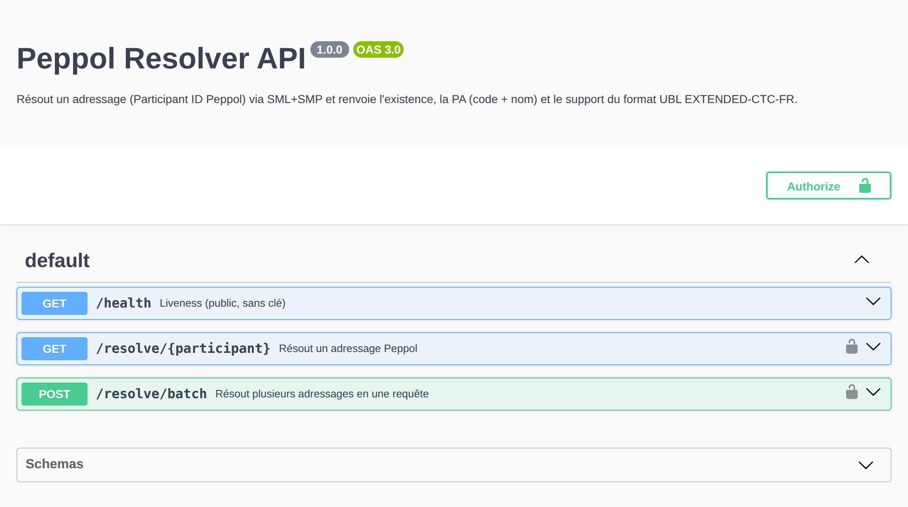

# `server/` — `peppol_api.py`, l'API REST du résolveur Peppol

Expose `peppol_resolver.py` (SML + SMP **direct**, aucune API tierce) derrière
une petite API HTTP protégée par **clé d'API**, pensée pour tourner sur un VPS
derrière **nginx (TLS)** et lancée par **systemd**. Serveur `http.server`
threadé, **sans framework** — seules dépendances : celles du résolveur
(`dnspython`, `cryptography`, cf. [`requirements.txt`](requirements.txt)).

Pour un adressage donné (Participant ID Peppol), l'endpoint principal répond
simplement : **existe ?**, **code de la PA** (Common Name du certificat de
l'Access Point), **nom de la PA** (Organization du certificat), **pays**, et
**support du format UBL EXTENDED-CTC-FR** (facture structurée principale du
PASR France §6.1.c).

## Démarrage rapide

```bash
pip install -r requirements.txt

# 1. Générer une clé
python peppol_api.py --gen-key            # -> collez-la dans un fichier de clés

# 2. Lancer (écoute 127.0.0.1:8080 par défaut)
python peppol_api.py --keys "MA_CLE" --port 8080
#   ou :  PEPPOL_API_KEYS_FILE=/etc/peppol-api.keys python peppol_api.py

# 3. Appeler
curl http://127.0.0.1:8080/health                              # public
curl -H "X-API-Key: MA_CLE" \
     http://127.0.0.1:8080/resolve/0225:000122308              # réponse simple
curl -H "Authorization: Bearer MA_CLE" \
     "http://127.0.0.1:8080/resolve/0225:000122308?test=1"     # SML de test
curl -H "X-API-Key: MA_CLE" \
     "http://127.0.0.1:8080/resolve/0225:000122308?detail=full"  # + JSON complet

# 4. Batch : jusqu'à 500 adressages en une requête (POST JSON)
curl -X POST -H "X-API-Key: MA_CLE" -H "Content-Type: application/json" \
     -d '{"participants":["0225:000122308","0225:931153688"]}' \
     http://127.0.0.1:8080/resolve/batch
```

Exemple de réponse :

```json
{
  "participant_id": "iso6523-actorid-upis::0225:000122308",
  "scheme": "iso6523-actorid-upis",
  "value": "0225:000122308",
  "exists": true,
  "pa": { "code": "PFR000123", "name": "Exemple SAS", "country": "FR" },
  "supports_extended_ctc_fr": true
}
```

## Endpoints

| Endpoint | Auth | Rôle |
|---|---|---|
| `GET /health` | non | liveness (healthcheck reverse-proxy / monitoring) |
| `GET /openapi.json` | non | spec OpenAPI 3.0 |
| `GET /docs` | non | **Swagger UI** interactive |
| `GET /resolve/{participant}` | clé | réponse simple (`?test=1` pour le SML de test, `?detail=full` pour le JSON complet du résolveur) |
| `GET /resolve?participant={id}` | clé | idem, PID en query |
| `POST /resolve/batch` | clé | résout une liste (≤ 500) : `{"participants":[…],"test":false}` → `{count, results}` ; erreurs isolées par item |
| `GET /limits` | clé | quota de la clé présentée : `{current, limit, burst, retry_after}` |



<sub>Capture régénérable après tout changement d'API :
`bash docs/make_swagger_png.sh` depuis la racine du repo (rendu hors-ligne via
Chromium, sans CDN).</sub>

## Sécurité / robustesse

- **Plusieurs clés** nommées et révocables (une par client), comparaison en
  temps constant.
- **Rate-limiting token-bucket par clé**, chaque clé pouvant porter son propre
  débit ; le `--rate-limit` global n'est que le **défaut** pour les clés qui
  n'en précisent pas.
- **Concurrence bornée** (`--max-concurrency`) : les résolutions sont I/O-bound
  vers le réseau Peppol.
- `/health` public pour le healthcheck.
- Un participant enregistré mais dont le SMP refuse le catalogue (403) renvoie
  `exists: true` avec `supports_extended_ctc_fr: null` et une `note`.

**Format d'une clé** (fichier `--keys-file` ou entrées `--keys` séparées par
des virgules), champs séparés par des espaces :

```
label=CLE [rate] [burst]
```

- `rate` : requêtes/min propres à la clé ; omis ou `-` = défaut global ; `0` =
  illimité pour cette clé.
- `burst` : pic propre ; omis = égal au `rate` de la clé.

```
# fichier de clés
monclient=Xy9...abc              # hérite du défaut global (--rate-limit)
partenaire=Zk3...def   600  100  # 600 req/min, pic 100, propres à cette clé
interne=Qw7...ghi      0         # illimitée
audit=Rt2...jkl        -    5    # rate défaut, pic 5
```

Un batch coûte **un jeton par adressage** (pas un par requête).

## Configuration

Par CLI ou variables d'environnement :

| CLI | Env | Rôle |
|---|---|---|
| `--host` | `PEPPOL_API_HOST` | adresse d'écoute (défaut `127.0.0.1`) |
| `--port` | `PEPPOL_API_PORT` | port (défaut `8080`) |
| `--keys` / `--keys-file` | `PEPPOL_API_KEYS` / `PEPPOL_API_KEYS_FILE` | clés d'API |
| `--rate-limit` | `PEPPOL_API_RATE_LIMIT` | débit par défaut, req/min (défaut `60`) |
| `--rate-burst` | `PEPPOL_API_RATE_BURST` | pic par défaut (défaut = rate-limit) |
| `--max-concurrency` | `PEPPOL_API_MAX_CONCURRENCY` | résolutions simultanées |
| `--dns-server` | `PEPPOL_API_DNS_SERVER` | serveur DNS pour les NAPTR |
| `--dns-fallback` | `PEPPOL_API_DNS_FALLBACK` | résolveur de secours quand le principal échoue après retries (défaut `8.8.8.8`, chaîne vide pour désactiver) |

Passe-plats réseau du résolveur : `--proxy`, `--ca-bundle`, `--insecure`,
`--doh`.

## `peppol_resolver.py` — le résolveur (et outil de debug CLI)

Pipeline complet, sans API tierce :

1. SHA-256 + base32 sur `lowercase(value)` → hostname dans le SML ;
2. DNS **NAPTR** sur `participant.sml.prod.tech.peppol.org` → URL du SMP ;
3. `GET <smp_url>/<urlencode(pid)>` → ServiceGroup (doctypes supportés) ;
4. pour chaque ServiceMetadataReference, `GET` → ServiceMetadata ;
5. extraction par Endpoint : URL AS4 + certificat X.509 ;
6. parse du cert → identification de l'AP (= PA française dans le contexte CTC).

Retry avec backoff sur 429/503 (`Retry-After` respecté) ; côté DNS, retries sur
les erreurs transitoires (le SML autoritaire fait du Response Rate Limiting
sous rafale) et **sémaphore** bornant les lookups NAPTR simultanés.

Sert aussi de **résolveur unitaire de debug** en CLI :

```bash
# Sortie lisible (résumé par AP)
python peppol_resolver.py 0225:000122308

# JSON brut complet
python peppol_resolver.py 0225:000122308 --full

# Léger : s'arrête à SML+SMP, pas de cert ni de doctypes
python peppol_resolver.py 0225:000122308 --ap-only

# Diagnostic : trace HTTP + sonde plusieurs variantes en cas de 4xx
python peppol_resolver.py 0225:000122308 --debug
```

Flags réseau : `--test` (SMK), `--proxy`, `--ca-bundle`, `--insecure`,
`--dns-server`, `--doh [endpoint]` (DNS-over-HTTPS — passe par le proxy et le
CA bundle, indispensable derrière un proxy d'entreprise qui bloque le DNS
sortant ou ne propage pas les NAPTR externes).

## Déploiement VPS

Script d'installation **idempotent** [`../deploy/install.sh`](../deploy/install.sh)
qui automate durcissement → déploiement → systemd → nginx → TLS. Bootstrap en un
seul `curl` (le script fait ensuite un **clone partiel + sparse** : seuls
`server/` et `deploy/` descendent, pas tout le dépôt) :

```bash
# Connecté en 'debian' (images Debian OVH) : sudo + env pour passer les variables.
curl -fsSL https://raw.githubusercontent.com/Sandjab/superpopaul/main/deploy/install.sh -o install.sh
sudo env DOMAIN=peppol.mondomaine.fr EMAIL=vous@exemple.fr bash install.sh
# (sans DOMAIN/EMAIL dans l'environnement, le script les demande interactivement)
```

Fichiers de référence dans [`../deploy/`](../deploy/) — `peppol-api.service`
(écoute locale, clés en fichier `600`, durcissement systemd),
`nginx-peppol-api.conf` (HTTPS + redirection 80→443 + rate-limit de bordure),
`peppol-api.keys.example`. Mode opératoire complet pas-à-pas pour un VPS
OVHcloud (commande, DNS, TLS Let's Encrypt) :
[`../docs/deploiement-ovh.md`](../docs/deploiement-ovh.md).

## Tests

```bash
pip install -r requirements.txt      # les tests importent le résolveur
python3 -m unittest discover -s tests
```
